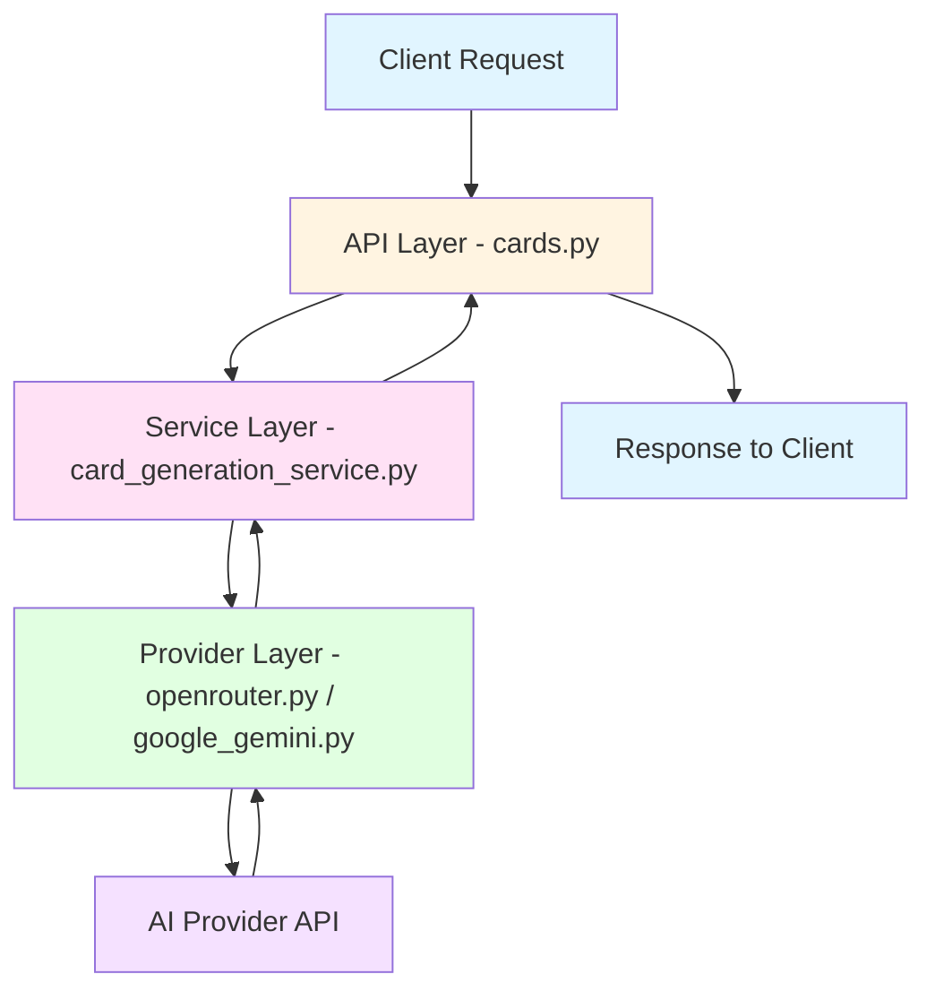
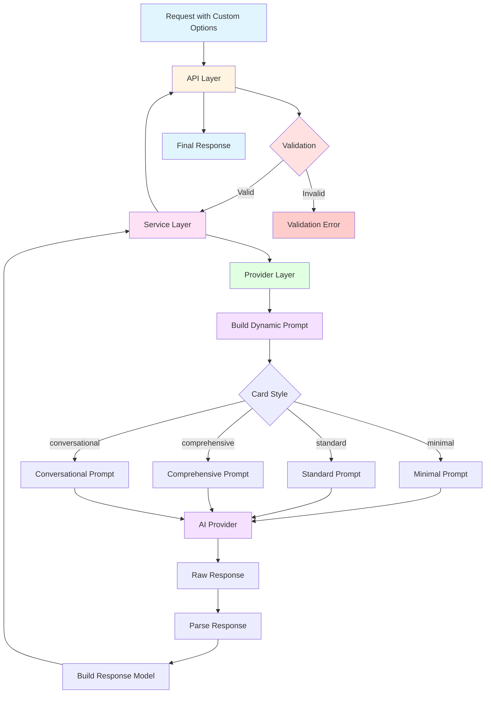

# Master Plan - Anki AI Service

## 📋 Overview / خلاصه

This document serves as the master plan for all features and improvements to the Anki AI Service project. It is designed to be continuously updated as new features are planned and implemented.

این سند به عنوان پلن اصلی برای تمام ویژگی‌ها و بهبودهای پروژه Anki AI Service عمل می‌کند. این سند به گونه‌ای طراحی شده است که با برنامه‌ریزی و پیاده‌سازی ویژگی‌های جدید به طور مداوم به‌روزرسانی شود.

---

## 📊 Table of Contents / فهرست مطالب

1. [Project Overview](#project-overview)
2. [Current Architecture](#current-architecture)
3. [Feature Roadmap](#feature-roadmap)
4. [Active Features](#active-features)
5. [Completed Features](#completed-features)
6. [Future Considerations](#future-considerations)

---

## 🏗️ Project Overview / مرور پروژه

### Description / توضیحات

The Anki AI Service is a Python-based service that generates flashcards for language learning using multiple AI providers (Google Gemini and OpenRouter/Cerebras).

سرویس Anki AI یک سرویس مبتنی بر پایتون است که کارت‌های فلش‌کارت برای یادگیری زبان با استفاده از چندین ارائه‌دهنده هوش مصنوعی (Google Gemini و OpenRouter/Cerebras) تولید می‌کند.

### Tech Stack / تکنولوژی‌ها

- **Language**: Python
- **Framework**: FastAPI
- **AI Providers**: Google Gemini, OpenRouter/Cerebras
- **Validation**: Pydantic
- **Testing**: Pytest

---

## 🏛️ Current Architecture / معماری فعلی



### Key Files / فایل‌های کلیدی

| File | Role | نقش |
|------|------|------|
| [`ai_service/app/models/request.py`](ai_service/app/models/request.py:1) | Request Models | مدل‌های درخواست |
| [`ai_service/app/models/response.py`](ai_service/app/models/response.py:1) | Response Models | مدل‌های پاسخ |
| [`ai_service/app/services/card_generation_service.py`](ai_service/app/services/card_generation_service.py:1) | Service Layer | لایه سرویس |
| [`ai_service/app/providers/openrouter.py`](ai_service/app/providers/openrouter.py:1) | OpenRouter Provider | ارائه‌دهنده OpenRouter |
| [`ai_service/app/providers/google_gemini.py`](ai_service/app/providers/google_gemini.py:1) | Google Gemini Provider | ارائه‌دهنده Google Gemini |
| [`ai_service/app/api/v1/cards.py`](ai_service/app/api/v1/cards.py:1) | API Routes | مسیرهای API |
| [`ai_service/app/core/config.py`](ai_service/app/core/config.py:1) | Configuration | تنظیمات |

---

## 🗺️ Feature Roadmap / نقشه راه ویژگی‌ها

### Priority Levels / سطوح اولویت

- 🔴 **High Priority** / اولویت بالا
- 🟡 **Medium Priority** / اولویت متوسط
- 🟢 **Low Priority** / اولویت پایین

### Status Labels / برچسب‌های وضعیت

- 📋 **Planned** / برنامه‌ریزی شده
- 🚧 **In Progress** / در حال انجام
- ✅ **Completed** / تکمیل شده
- ⏸️ **On Hold** / معلق

---

## 🚀 Active Features / ویژگی‌های فعال

---

## 🔴 FEATURE 1: Enhance Card Generation Quality with Customization Options

**Status**: 📋 Planned / برنامه‌ریزی شده  
**Priority**: 🔴 High / بالا  
**Category**: Core Functionality / عملکرد اصلی

### Overview / خلاصه

Add advanced customization options to improve the quality of generated flashcards, allowing users to tailor cards to their specific learning needs.

افزودن گزینه‌های سفارشی‌سازی پیشرفته برای بهبود کیفیت کارت‌های فلش‌کارت تولید شده، به طوری که کاربران بتوانند کارت‌ها را مطابق نیازهای یادگیری خاص خود تنظیم کنند.

### Goals / اهداف

1. **Add Card Style Options** / افزودن گزینه‌های سبک کارت
   - Allow users to choose card style (minimal, standard, comprehensive, conversational)
   - امکان انتخاب سبک کارت توسط کاربران (مینیمال، استاندارد، جامع، مکالمه‌ای)

2. **Customize Examples** / سفارشی‌سازی مثال‌ها
   - Control number of examples (1-5)
   - Choose example style (formal, informal, neutral)
   - کنترل تعداد مثال‌ها (۱ تا ۵)
   - انتخاب سبک مثال‌ها (رسمی، غیررسمی، خنثی)

3. **Add Context Support** / افزودن پشتیبانی از زمینه
   - Allow specifying context (business, medical, casual, etc.)
   - امکان تعیین زمینه (کسب‌وکار، پزشکی، روزمره و غیره)

4. **Detail Level Control** / کنترل سطح جزئیات
   - Choose definition depth (basic, detailed, academic)
   - انتخاب سطح جزئیات تعریف (پایه، دقیق، آکادمیک)

5. **Additional Card Fields** / فیلدهای اضافی کارت
   - Synonyms, antonyms, etymology, collocations, idioms
   - مترادف‌ها، متضادها، ریشه‌شناسی، عبارات رایج، اصطلاحات

### Proposed Architecture / معماری پیشنهادی



### Implementation Details / جزئیات پیاده‌سازی

#### 1. New Enums / Enumهای جدید

```python
class CardStyle(str, Enum):
    """Flashcard style / سبک کارت فلش‌کارت"""
    MINIMAL = "minimal"          # Only definition + 1 simple example / فقط تعریف + یک مثال ساده
    STANDARD = "standard"        # All current fields / تمام فیلدهای فعلی
    COMPREHENSIVE = "comprehensive"  # All fields + synonyms + etymology / تمام فیلدها + مترادف‌ها + ریشه‌شناسی
    CONVERSATIONAL = "conversational"  # Focus on conversation / تمرکز بر مکالمه

class ExampleStyle(str, Enum):
    """Example style / سبک مثال‌ها"""
    FORMAL = "formal"            # Formal and academic examples / مثال‌های رسمی و آکادمیک
    INFORMAL = "informal"        # Informal and conversational examples / مثال‌های غیررسمی و محاوره‌ای
    NEUTRAL = "neutral"          # Standard and neutral examples / مثال‌های استاندارد و خنثی

class DetailLevel(str, Enum):
    """Definition detail level / سطح جزئیات تعریف"""
    BASIC = "basic"              # Simple and concise definition / تعریف ساده و مختصر
    DETAILED = "detailed"        # Definition with more details / تعریف با جزئیات بیشتر
    ACADEMIC = "academic"        # Academic and specialized definition / تعریف آکادمیک و تخصصی
```

#### 2. Updated Request Model / مدل درخواست به‌روزرسانی شده

```python
class CardGenerationRequest(BaseModel):
    """Payload for card generation endpoint / Payload برای نقطه پایانی تولید کارت"""
    
    # Existing fields / فیلدهای موجود
    term: str
    language: str = "en"
    target_language: str = "fa"
    level: Level = Level.BEGINNER
    
    # New customization options / گزینه‌های سفارشی‌سازی جدید
    card_style: CardStyle = CardStyle.STANDARD
    include_examples: int = Field(default=2, ge=1, le=5)
    include_pronunciation: bool = True
    include_memory_tip: bool = True
    example_style: ExampleStyle = ExampleStyle.NEUTRAL
    definition_depth: DetailLevel = DetailLevel.BASIC
    context: Optional[str] = Field(default=None, max_length=200)
    difficulty_adjustment: Optional[str] = Field(default=None)
```

#### 3. Updated Response Model / مدل پاسخ به‌روزرسانی شده

```python
class CardBack(BaseModel):
    """Structured content for flashcard back / محتوای ساختاریافته برای پشت کارت"""
    
    # Existing fields / فیلدهای موجود
    definition: str
    pronunciation: Optional[Pronunciation]
    part_of_speech: Optional[str]
    usage: Optional[str]
    examples: List[Example]
    memory_tip: Optional[str]
    
    # New fields / فیلدهای جدید
    synonyms: Optional[List[str]] = None
    antonyms: Optional[List[str]] = None
    etymology: Optional[str] = None
    collocations: Optional[List[str]] = None
    idioms: Optional[List[str]] = None
```

### Files to Modify / فایل‌هایی که تغییر می‌کنند

| File | Changes / تغییرات |
|------|-------------------|
| [`ai_service/app/models/request.py`](ai_service/app/models/request.py:1) | Add new Enums and update request models / افزودن Enumهای جدید و به‌روزرسانی مدل‌های درخواست |
| [`ai_service/app/models/response.py`](ai_service/app/models/response.py:1) | Add new fields to CardBack / افزودن فیلدهای جدید به CardBack |
| [`ai_service/app/services/card_generation_service.py`](ai_service/app/services/card_generation_service.py:1) | Update method signatures / به‌روزرسانی امضای متدها |
| [`ai_service/app/api/v1/cards.py`](ai_service/app/api/v1/cards.py:1) | Update route handlers / به‌روزرسانی کنترلرهای مسیر |
| [`ai_service/app/providers/openrouter.py`](ai_service/app/providers/openrouter.py:1) | Implement dynamic prompt building / پیاده‌سازی ساخت پرامپت پویا |
| [`ai_service/app/providers/google_gemini.py`](ai_service/app/providers/google_gemini.py:1) | Implement dynamic prompt building / پیاده‌سازی ساخت پرامپت پویا |

### Implementation Checklist / چک‌لیست پیاده‌سازی

- [ ] Add new Enums to request.py / افزودن Enumهای جدید به request.py
- [ ] Update CardGenerationRequest / به‌روزرسانی CardGenerationRequest
- [ ] Update CardGenerationFromTopicRequest / به‌روزرسانی CardGenerationFromTopicRequest
- [ ] Update CardBack with new fields / به‌روزرسانی CardBack با فیلدهای جدید
- [ ] Update CardGenerationService methods / به‌روزرسانی متدهای CardGenerationService
- [ ] Update API route handlers / به‌روزرسانی کنترلرهای مسیر API
- [ ] Implement _build_prompt_template() in openrouter.py / پیاده‌سازی _build_prompt_template() در openrouter.py
- [ ] Implement _build_prompt_template() in google_gemini.py / پیاده‌سازی _build_prompt_template() در google_gemini.py
- [ ] Update generate_card() in openrouter.py / به‌روزرسانی generate_card() در openrouter.py
- [ ] Update generate_cards_from_topic() in openrouter.py / به‌روزرسانی generate_cards_from_topic() در openrouter.py
- [ ] Write unit tests for new features / نوشتن تست‌های واحد برای ویژگی‌های جدید
- [ ] Write API tests for new features / نوشتن تست‌های API برای ویژگی‌های جدید
- [ ] Update README documentation / به‌روزرسانی مستندات README
- [ ] Add API usage examples / افزودن نمونه‌های استفاده از API

### Example Usage / نمونه استفاده

```json
// Minimal card for beginners / کارت مینیمال برای مبتدیان
{
  "term": "ephemeral",
  "language": "en",
  "target_language": "fa",
  "level": "beginner",
  "card_style": "minimal",
  "include_examples": 1,
  "include_pronunciation": false,
  "include_memory_tip": false
}

// Comprehensive card for advanced learners / کارت جامع برای زبان‌آموزان پیشرفته
{
  "term": "ephemeral",
  "language": "en",
  "target_language": "fa",
  "level": "advanced",
  "card_style": "comprehensive",
  "include_examples": 3,
  "include_pronunciation": true,
  "include_memory_tip": true,
  "example_style": "formal",
  "definition_depth": "academic",
  "context": "literature"
}
```

### Benefits / مزایا

- ✅ **Flexibility** / انعطاف‌پذیری: Users can customize cards to their needs / کاربران می‌توانند کارت‌ها را مطابق نیاز خود سفارشی کنند
- ✅ **Better Quality** / کیفیت بهتر: Context-aware cards are more relevant / کارت‌های آگاه از زمینه مرتبط‌تر هستند
- ✅ **Efficiency** / کارایی: Simpler cards for beginners / کارت‌های ساده‌تر برای مبتدیان
- ✅ **Deeper Learning** / یادگیری عمیق‌تر: Additional fields enhance understanding / فیلدهای اضافی درک را بهبود می‌بخشند

### Related Issues / مسائل مرتبط

- None / هیچ

---

## ✅ Completed Features / ویژگی‌های تکمیل شده

---

## 🔮 Future Considerations / ملاحظات آینده

### Potential Future Features / ویژگی‌های احتمالی آینده

1. **Multi-language Support** / پشتیبانی چند زبانه
   - Add support for more language pairs / افزودن پشتیبانی از جفت‌های زبانی بیشتر
   - Language-specific prompts / پرامپت‌های خاص زبان

2. **User Preferences** / تنظیمات کاربر
   - Save user's default settings / ذخیره تنظیمات پیش‌فرض کاربر
   - Personalized recommendations / پیشنهادات شخصی‌سازی شده

3. **Card Templates** / قالب‌های کارت
   - Custom card templates / قالب‌های کارت سفارشی
   - Template marketplace / بازارچه قالب

4. **Analytics** / تحلیل‌ها
   - Track card effectiveness / ردیابی اثربخشی کارت
   - Learning analytics / تحلیل‌های یادگیری

5. **Batch Operations** / عملیات دسته‌ای
   - Generate multiple cards at once / تولید چندین کارت به صورت همزمان
   - Import/export functionality / قابلیت واردات/صادرات

6. **Audio Integration** / یکپارچه‌سازی صوتی
   - Generate pronunciation audio / تولید صوت تلفظ
   - Voice recognition for testing / تشخیص صدا برای تست

7. **Image Support** / پشتیبانی تصویر
   - Add images to cards / افزودن تصویر به کارت‌ها
   - AI-generated images / تصاویر تولید شده با AI

---

## 📝 Notes / یادداشت‌ها

- All new features should maintain backward compatibility / تمام ویژگی‌های جدید باید سازگاری با عقب را حفظ کنند
- Performance should be monitored with new features / عملکرد باید با ویژگی‌های جدید پایش شود
- Documentation should be updated with each feature / مستندات باید با هر ویژگی به‌روزرسانی شود

---

## 📞 Contact / تماس

For questions or suggestions, please contact the development team.

برای سوالات یا پیشنهادات، لطفاً با تیم توسعه تماس بگیرید.

---

**Document Version / نسخه سند**: 1.0  
**Last Updated / آخرین به‌روزرسانی**: 2025-02-23  
**Status / وضعیت**: Active / فعال
