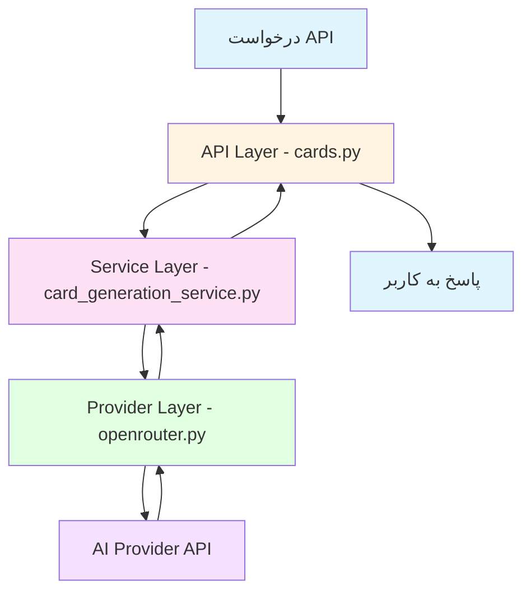
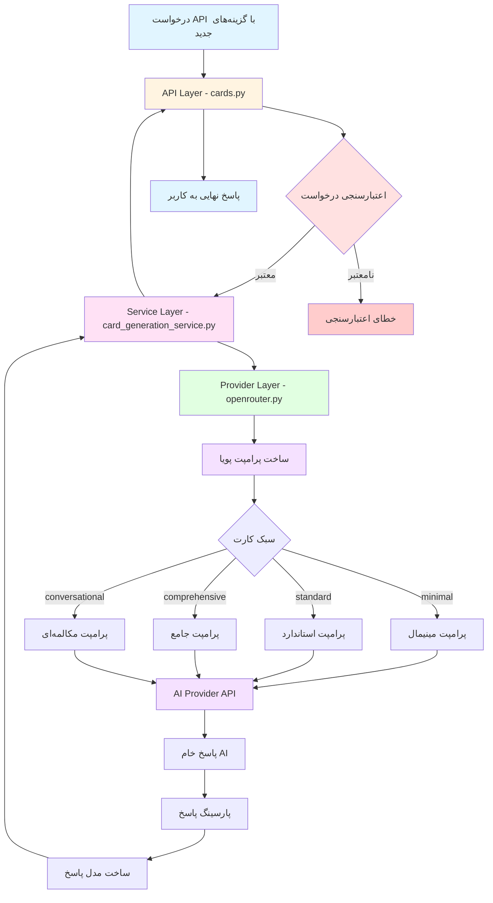

# پلن پیاده‌سازی: بهبود کیفیت تولید کارت‌ها با گزینه‌های سفارشی‌سازی بیشتر

## 📋 خلاصه پروژه

این پلن برای افزودن قابلیت‌های سفارشی‌سازی پیشرفته به سرویس تولید کارت‌های Anki با هوش مصنوعی طراحی شده است. هدف اصلی این است که کاربران بتوانند کارت‌های فلش‌کارت را دقیقاً مطابق نیازهای یادگیری خود تنظیم کنند.

---

## 🎯 اهداف اصلی

1. **افزودن گزینه‌های سبک کارت**: کاربران می‌توانند سبک کارت را انتخاب کنند (مینیمال، استاندارد، جامع، مکالمه‌ای)
2. **تنظیم تعداد و نوع مثال‌ها**: کنترل بر تعداد و سبک مثال‌ها (رسمی، غیررسمی، خنثی)
3. **افزودن زمینه و بافت**: امکان تعیین زمینه خاص برای تولید کارت (کسب‌وکار، پزشکی، روزمره و غیره)
4. **تنظیم سطح جزئیات تعریف**: انتخاب سطح جزئیات (پایه، دقیق، آکادمیک)
5. **فیلدهای اضافی برای CardBack**: مترادف‌ها، متضادها، ریشه‌شناسی، عبارات رایج و اصطلاحات

---

## 📊 معماری فعلی



### فایل‌های کلیدی فعلی

| فایل | نقش | توضیحات |
|------|------|---------|
| [`ai_service/app/models/request.py`](ai_service/app/models/request.py:1) | مدل درخواست | تعریف [`CardGenerationRequest`](ai_service/app/models/request.py:23) و [`CardGenerationFromTopicRequest`](ai_service/app/models/request.py:53) |
| [`ai_service/app/models/response.py`](ai_service/app/models/response.py:1) | مدل پاسخ | تعریف [`CardGenerationResponse`](ai_service/app/models/response.py:108) و [`CardBack`](ai_service/app/models/response.py:73) |
| [`ai_service/app/services/card_generation_service.py`](ai_service/app/services/card_generation_service.py:1) | سرویس | لایه سرویس برای تولید کارت |
| [`ai_service/app/providers/openrouter.py`](ai_service/app/providers/openrouter.py:1) | ارائه‌دهنده AI | پیاده‌سازی OpenRouter برای تولید کارت |
| [`ai_service/app/api/v1/cards.py`](ai_service/app/api/v1/cards.py:1) | API | تعریف مسیرهای API |
| [`ai_service/app/core/config.py`](ai_service/app/core/config.py:1) | تنظیمات | تنظیمات برنامه |

---

## 🏗️ معماری پیشنهادی



---

## 📝 جزئیات پیاده‌سازی

### مرحله ۱: به‌روزرسانی مدل‌های درخواست

#### فایل: [`ai_service/app/models/request.py`](ai_service/app/models/request.py:1)

#### اضافه کردن Enumهای جدید:

```python
class CardStyle(str, Enum):
    """سبک کارت فلش‌کارت"""
    MINIMAL = "minimal"          # فقط تعریف و یک مثال ساده
    STANDARD = "standard"        # تمام فیلدهای فعلی
    COMPREHENSIVE = "comprehensive"  # تمام فیلدها + مترادف‌ها + ریشه‌شناسی
    CONVERSATIONAL = "conversational"  # تمرکز بر مکالمه و استفاده روزمره

class ExampleStyle(str, Enum):
    """سبک مثال‌ها"""
    FORMAL = "formal"            # مثال‌های رسمی و آکادمیک
    INFORMAL = "informal"        # مثال‌های غیررسمی و محاوره‌ای
    NEUTRAL = "neutral"          # مثال‌های خنثی و استاندارد

class DetailLevel(str, Enum):
    """سطح جزئیات تعریف"""
    BASIC = "basic"              # تعریف ساده و مختصر
    DETAILED = "detailed"        # تعریف با جزئیات بیشتر
    ACADEMIC = "academic"        # تعریف آکادمیک و تخصصی
```

#### به‌روزرسانی [`CardGenerationRequest`](ai_service/app/models/request.py:23):

```python
class CardGenerationRequest(BaseModel):
    """Payload برای نقطه پایانی تولید کارت"""

    term: str = Field(
        ...,
        min_length=1,
        max_length=500,
        description="کلمه یا عبارتی که کارت فلش‌کارت برای آن تولید می‌شود.",
        examples=["ephemeral"],
    )
    language: str = Field(
        default="en",
        min_length=2,
        max_length=10,
        description="کد زبان ISO برای کلمه منبع.",
        examples=["en"],
    )
    target_language: str = Field(
        default="fa",
        min_length=2,
        max_length=10,
        description="کد زبان ISO برای زبان هدف کارت.",
        examples=["fa"],
    )
    level: Level = Field(
        default=Level.BEGINNER,
        description="سطح تسلط زبان‌آموز.",
    )
    
    # === گزینه‌های سفارشی‌سازی جدید ===
    
    card_style: CardStyle = Field(
        default=CardStyle.STANDARD,
        description="سبک کارت فلش‌کارت که میزان جزئیات را تعیین می‌کند.",
    )
    
    include_examples: int = Field(
        default=2,
        ge=1,
        le=5,
        description="تعداد مثال‌هایی که باید تولید شوند.",
    )
    
    include_pronunciation: bool = Field(
        default=True,
        description="آیا اطلاعات تلفظ شامل شود؟",
    )
    
    include_memory_tip: bool = Field(
        default=True,
        description="آیا نکته حافظه شامل شود؟",
    )
    
    example_style: ExampleStyle = Field(
        default=ExampleStyle.NEUTRAL,
        description="سبک مثال‌های تولید شده.",
    )
    
    definition_depth: DetailLevel = Field(
        default=DetailLevel.BASIC,
        description="سطح جزئیات تعریف.",
    )
    
    context: Optional[str] = Field(
        default=None,
        max_length=200,
        description="زمینه یا موضوع خاص برای کارت (مثلاً: business, medical, casual)",
    )
    
    difficulty_adjustment: Optional[str] = Field(
        default=None,
        description="تنظیم سختی کارت (easier یا harder)",
    )
```

#### به‌روزرسانی [`CardGenerationFromTopicRequest`](ai_service/app/models/request.py:53):

```python
class CardGenerationFromTopicRequest(BaseModel):
    """Payload برای نقطه پایانی تولید کارت از موضوع"""

    topic: str = Field(
        ...,
        min_length=10,
        max_length=500,
        description="موضوعی که کارت‌های فلش‌کارت برای آن تولید می‌شوند.",
        examples=["At the end of the day"],
    )

    count: int = Field(
        default=5,
        description="تعداد کارت‌های فلش‌کارت که باید تولید شوند.",
    )

    level: Level = Field(
        default=Level.BEGINNER,
        description="سطح تسلط زبان‌آموز.",
    )

    language: str = Field(
        default="en",
        min_length=2,
        max_length=10,
        description="کد زبان ISO برای کلمه منبع.",
        examples=["en"],
    )
    
    target_language: str = Field(
        default="fa",
        min_length=2,
        max_length=10,
        description="کد زبان ISO برای زبان هدف کارت.",
        examples=["fa"],
    )
    
    # === گزینه‌های سفارشی‌سازی جدید ===
    
    card_style: CardStyle = Field(
        default=CardStyle.STANDARD,
        description="سبک کارت فلش‌کارت که میزان جزئیات را تعیین می‌کند.",
    )
    
    include_examples: int = Field(
        default=2,
        ge=1,
        le=5,
        description="تعداد مثال‌هایی که باید تولید شوند.",
    )
    
    include_pronunciation: bool = Field(
        default=True,
        description="آیا اطلاعات تلفظ شامل شود؟",
    )
    
    include_memory_tip: bool = Field(
        default=True,
        description="آیا نکته حافظه شامل شود؟",
    )
    
    example_style: ExampleStyle = Field(
        default=ExampleStyle.NEUTRAL,
        description="سبک مثال‌های تولید شده.",
    )
    
    definition_depth: DetailLevel = Field(
        default=DetailLevel.BASIC,
        description="سطح جزئیات تعریف.",
    )
    
    context: Optional[str] = Field(
        default=None,
        max_length=200,
        description="زمینه یا موضوع خاص برای کارت‌ها (مثلاً: business, medical, casual)",
    )
    
    difficulty_adjustment: Optional[str] = Field(
        default=None,
        description="تنظیم سختی کارت‌ها (easier یا harder)",
    )
```

---

### مرحله ۲: به‌روزرسانی مدل‌های پاسخ

#### فایل: [`ai_service/app/models/response.py`](ai_service/app/models/response.py:1)

#### به‌روزرسانی [`CardBack`](ai_service/app/models/response.py:73):

```python
class CardBack(BaseModel):
    """محتوای ساختاریافته برای پشت کارت فلش‌کارت.
    
    این مدل تمام محتوای آموزشی که در پشت یک کارت فلش‌کارت ظاهر می‌شود
    شامل تعریف، تلفظ، مثال‌ها و نکات حافظه را در بر می‌گیرد.
    """
    
    definition: str = Field(
        default="",
        description="تعریف اصلی یا ترجمه اصطلاح.",
    )
    pronunciation: Optional[Pronunciation] = Field(
        default=None,
        description="راهنمای تلفظ و پیکربندی TTS.",
    )
    part_of_speech: Optional[str] = Field(
        default=None,
        description="دسته بندی دستوری (اسم، فعل، صفت و غیره).",
        examples=["noun", "verb", "adjective", "adverb"],
    )
    usage: Optional[str] = Field(
        default=None,
        description="توضیح کاربرد واقعی نحوه استفاده از این کلمه.",
    )
    examples: List[Example] = Field(
        default_factory=list,
        description="لیست جملات نمونه که نحوه استفاده را نشان می‌دهند.",
    )
    memory_tip: Optional[str] = Field(
        default=None,
        description="نکته حافظه کوتاه و مفید برای به یاد آوردن کلمه.",
    )
    
    # === فیلدهای جدید ===
    
    synonyms: Optional[List[str]] = Field(
        default=None,
        description="لیست مترادف‌های کلمه.",
        examples=["brief", "short-lived", "temporary"],
    )
    
    antonyms: Optional[List[str]] = Field(
        default=None,
        description="لیست متضادهای کلمه.",
        examples=["permanent", "lasting", "eternal"],
    )
    
    etymology: Optional[str] = Field(
        default=None,
        description="ریشه‌شناسی کلمه و منشأ آن.",
        examples="از یونانی باستان: epi- (روی) + hemera (روز)",
    )
    
    collocations: Optional[List[str]] = Field(
        default=None,
        description="عبارات رایج و ترکیبات با این کلمه.",
        examples=["ephemeral beauty", "ephemeral nature", "ephemeral pleasure"],
    )
    
    idioms: Optional[List[str]] = Field(
        default=None,
        description="اصطلاحات و ضرب‌المثل‌های مرتبط با کلمه.",
    )
```

---

### مرحله ۳: به‌روزرسانی سرویس

#### فایل: [`ai_service/app/services/card_generation_service.py`](ai_service/app/services/card_generation_service.py:1)

```python
# app/services/card_generation_service.py
from app.providers import get_ai_provider
from app.models.response import CardGenerationResponse, CardGenerationFromTopicResponse

class CardGenerationService:
    """سرویسی که به ارائه‌دهندگان AI تفویض اختیار می‌کند."""
    
    def __init__(self):
        self.provider = get_ai_provider()
    
    async def generate_card(
        self, 
        term: str, 
        language: str, 
        target_language: str, 
        level: str,
        # پارامترهای جدید
        card_style: str = "standard",
        include_examples: int = 2,
        include_pronunciation: bool = True,
        include_memory_tip: bool = True,
        example_style: str = "neutral",
        definition_depth: str = "basic",
        context: str = None,
        difficulty_adjustment: str = None,
    ) -> CardGenerationResponse:
        return await self.provider.generate_card(
            term=term,
            language=language,
            target_language=target_language,
            level=level,
            card_style=card_style,
            include_examples=include_examples,
            include_pronunciation=include_pronunciation,
            include_memory_tip=include_memory_tip,
            example_style=example_style,
            definition_depth=definition_depth,
            context=context,
            difficulty_adjustment=difficulty_adjustment,
        )
    
    async def generate_card_from_topic(
        self,
        topic: str,
        count: int,
        level: str,
        language: str,
        target_language: str,
        # پارامترهای جدید
        card_style: str = "standard",
        include_examples: int = 2,
        include_pronunciation: bool = True,
        include_memory_tip: bool = True,
        example_style: str = "neutral",
        definition_depth: str = "basic",
        context: str = None,
        difficulty_adjustment: str = None,
    ) -> CardGenerationFromTopicResponse:
        return await self.provider.generate_cards_from_topic(
            topic=topic,
            count=count,
            level=level,
            language=language,
            target_language=target_language,
            card_style=card_style,
            include_examples=include_examples,
            include_pronunciation=include_pronunciation,
            include_memory_tip=include_memory_tip,
            example_style=example_style,
            definition_depth=definition_depth,
            context=context,
            difficulty_adjustment=difficulty_adjustment,
        )
```

---

### مرحله ۴: به‌روزرسانی API

#### فایل: [`ai_service/app/api/v1/cards.py`](ai_service/app/api/v1/cards.py:1)

```python
@router.post(
    "/generate-flashcards",
    response_model=CardGenerationResponse,    
)
async def generate_card(
    request: CardGenerationRequest,
    service:CardGenerationService=Depends(get_card_service),
    user: dict = Depends(get_current_user),
):
    """تولید کارت فلش‌کارت برای کاربر احراز هویت شده."""
    logger.info(f"Generating flashcard for user: {user.get('user_id')}")
    
    result = await service.generate_card(
        term=request.term,
        language=request.language,
        target_language=request.target_language,
        level=request.level,
        # پارامترهای جدید
        card_style=request.card_style,
        include_examples=request.include_examples,
        include_pronunciation=request.include_pronunciation,
        include_memory_tip=request.include_memory_tip,
        example_style=request.example_style,
        definition_depth=request.definition_depth,
        context=request.context,
        difficulty_adjustment=request.difficulty_adjustment,
    )
    return result


@router.post(
    "/generate-from-topic",
    response_model=CardGenerationFromTopicResponse,    
)
async def generate_card_from_topic(
    request: CardGenerationFromTopicRequest,
    service:CardGenerationService=Depends(get_card_service),
    user: dict = Depends(get_current_user),
):
    logger.info(f"Generating flashcard from topic for user: {user.get('user_id')}")
    result = await service.generate_card_from_topic(
        topic=request.topic,
        count=request.count,
        level=request.level,
        language=request.language,
        target_language=request.target_language,
        # پارامترهای جدید
        card_style=request.card_style,
        include_examples=request.include_examples,
        include_pronunciation=request.include_pronunciation,
        include_memory_tip=request.include_memory_tip,
        example_style=request.example_style,
        definition_depth=request.definition_depth,
        context=request.context,
        difficulty_adjustment=request.difficulty_adjustment,
    )
    return result
```

---

### مرحله ۵: به‌روزرسانی ارائه‌دهنده AI

#### فایل: [`ai_service/app/providers/openrouter.py`](ai_service/app/providers/openrouter.py:1)

#### اضافه کردن تابع کمکی برای ساخت پرامپت پویا:

```python
def _build_prompt_template(
    card_style: str,
    include_examples: int,
    include_pronunciation: bool,
    include_memory_tip: bool,
    example_style: str,
    definition_depth: str,
    context: str,
    difficulty_adjustment: str,
    target_language: str,
    language: str,
) -> str:
    """ساخت قالب پرامپت بر اساس گزینه‌های سفارشی‌سازی."""
    
    # ساخت بخش سبک کارت
    style_instructions = {
        "minimal": "فقط تعریف و یک مثال ساده ارائه دهید. بدون جزئیات اضافی.",
        "standard": "تمام فیلدهای استاندارد را شامل تعریف، تلفظ، مثال‌ها و نکته حافظه ارائه دهید.",
        "comprehensive": "همه فیلدها را شامل مترادف‌ها، متضادها، ریشه‌شناسی، عبارات رایج و اصطلاحات ارائه دهید.",
        "conversational": "تمرکز بر استفاده مکالمه‌ای و کاربرد روزمره. مثال‌ها باید طبیعی و محاوره‌ای باشند."
    }
    
    # ساخت بخش سبک مثال
    example_style_instructions = {
        "formal": "مثال‌ها باید رسمی و آکادمیک باشند.",
        "informal": "مثال‌ها باید غیررسمی و محاوره‌ای باشند.",
        "neutral": "مثال‌ها باید استاندارد و خنثی باشند."
    }
    
    # ساخت بخش سطح جزئیات
    depth_instructions = {
        "basic": "تعریف ساده و مختصر.",
        "detailed": "تعریف با جزئیات بیشتر و توضیحات اضافی.",
        "academic": "تعریف آکادمیک و تخصصی با جزئیات علمی."
    }
    
    # ساخت بخش زمینه
    context_instruction = ""
    if context:
        context_instruction = f"\n\nزمینه: همه مثال‌ها و تعاریف باید مرتبط با زمینه '{context}' باشند."
    
    # ساخت بخش تنظیم سختی
    difficulty_instruction = ""
    if difficulty_adjustment:
        if difficulty_adjustment == "easier":
            difficulty_instruction = "\n\nتنظیم سختی: کلمات و تعاریف ساده‌تر از سطح معمول استفاده کنید."
        elif difficulty_adjustment == "harder":
            difficulty_instruction = "\n\nتنظیم سختی: کلمات و تعاریف پیچیده‌تر از سطح معمول استفاده کنید."
    
    # ساخت بخش فیلدهای اختیاری
    optional_fields = []
    if include_pronunciation:
        optional_fields.append("تلفظ")
    if include_memory_tip:
        optional_fields.append("نکته حافظه")
    
    optional_fields_instruction = ""
    if optional_fields:
        optional_fields_instruction = f"\n\nفیلدهای اختیاری: {', '.join(optional_fields)} باید شامل شوند."
    else:
        optional_fields_instruction = "\n\nفیلدهای اختیاری: هیچ فیلد اختیاری نباید شامل شود."
    
    # ترکیب تمام بخش‌ها
    prompt_template = f"""
سبک کارت: {style_instructions.get(card_style, style_instructions['standard'])}
سبک مثال: {example_style_instructions.get(example_style, example_style_instructions['neutral'])}
سطح جزئیات تعریف: {depth_instructions.get(definition_depth, depth_instructions['basic'])}
تعداد مثال‌ها: {include_examples}{context_instruction}{difficulty_instruction}{optional_fields_instruction}
"""
    
    return prompt_template
```

#### به‌روزرسانی متد [`generate_card`](ai_service/app/providers/openrouter.py:175):

```python
async def generate_card(
    self,
    term: str,
    language: str,
    target_language: str,
    level: str,
    # پارامترهای جدید
    card_style: str = "standard",
    include_examples: int = 2,
    include_pronunciation: bool = True,
    include_memory_tip: bool = True,
    example_style: str = "neutral",
    definition_depth: str = "basic",
    context: str = None,
    difficulty_adjustment: str = None,
) -> CardGenerationResponse:

    # ساخت دستورالعمل‌های سفارشی
    custom_instructions = self._build_prompt_template(
        card_style=card_style,
        include_examples=include_examples,
        include_pronunciation=include_pronunciation,
        include_memory_tip=include_memory_tip,
        example_style=example_style,
        definition_depth=definition_depth,
        context=context,
        difficulty_adjustment=difficulty_adjustment,
        target_language=target_language,
        language=language,
    )

    # ساخت بخش فیلدهای JSON بر اساس گزینه‌ها
    json_fields = []
    
    # فیلدهای اجباری
    json_fields.append(f'"definition": "تعریف در {target_language}"')
    
    if include_pronunciation:
        json_fields.append(f'"pronunciation": {{"text": "راهنمای تلفظ", "hint": null, "tts": {{"text": "{term}", "lang": "{language}"}}}}}')
    
    json_fields.append(f'"part_of_speech": "دسته بندی دستوری در {target_language}"')
    json_fields.append(f'"usage": "کاربرد در {target_language}"')
    
    # مثال‌ها
    examples_field = f'"examples": ['
    for i in range(include_examples):
        if i > 0:
            examples_field += ', '
        examples_field += f'{{"text": "مثال در {language}", "tts": {{"text": "...", "lang": "{language}"}}}}'
    examples_field += ']'
    json_fields.append(examples_field)
    
    if include_memory_tip:
        json_fields.append(f'"memory_tip": "نکته حافظه در {target_language}"')
    
    # فیلدهای اضافی برای سبک comprehensive
    if card_style == "comprehensive":
        json_fields.append('"synonyms": ["مترادف 1", "مترادف 2"]')
        json_fields.append('"antonyms": ["متضاد 1", "متضاد 2"]')
        json_fields.append('"etymology": "ریشه‌شناسی کلمه"')
        json_fields.append('"collocations": ["عبارت رایج 1", "عبارت رایج 2"]')
        json_fields.append('"idioms": ["اصطلاح 1"]')
    
    json_structure = ', '.join(json_fields)

    prompt = f'''You are a JSON API. You MUST respond with ONLY valid JSON.

CRITICAL RULES:
1. Start your response with {{ and end with }}
2. Do NOT write any thinking, reasoning, or explanation
3. Do NOT use markdown code blocks
4. Do NOT write anything before or after the JSON

CUSTOM INSTRUCTIONS:
{custom_instructions}

Generate a flashcard for "{term}" in this EXACT format:

{{"front": "{term}", "difficulty": "easy", "back": {{{json_structure}}}}}

INPUT:
- Word: "{term}"
- Level: "{level}"
- Source Language: "{language}"
- Target Language: "{target_language}"

RESPOND WITH JSON ONLY:'''

    logger.info("Generating card for term: '%s' with style: '%s'", term, card_style)
    
    try:
        response = self.client.chat.completions.create(
            model=settings.CEREBRAS_MODEL,
            messages=[
                {"role": "system", "content": "You are a JSON API. You MUST respond with ONLY valid JSON. No thinking, no reasoning, no explanation. Start with { and end with }."},
                {"role": "user", "content": prompt},
            ],
            response_format={"type": "json_object"},
            max_tokens=settings.OPENROUTER_MAX_TOKENS,
            extra_headers={
                "HTTP-Referer": settings.OPENROUTER_REFERER,
                "X-Title": settings.OPENROUTER_SITE_TITLE,
            },
        )

    except openai.RateLimitError as e:
        logger.warning("Rate limit by provider")
        raise APIRateLimitError()

    except openai.APIError as e:
        logger.warning("Open AI error:%s", e)
        raise APIProviderError()

    raw = response.choices[0].message.content.strip()
    logger.info("Raw response: %s", raw)

    raw = re.sub(r'^```(?:json)?\s*', '', raw) 
    raw = re.sub(r'\s*```$', '', raw)
    raw = raw.strip()

    try:
        data = json.loads(raw)
    except json.JSONDecodeError:
        logger.error("Failed to parse AI response as JSON: %s", raw)
        raise InvalidResponseError()

    back_data = data.get("back", {})

    # 1. پارس کردن تلفظ
    pronunciation = None
    pronunciation_data = back_data.get("pronunciation", {})
    if pronunciation_data and include_pronunciation:
        tts = None
        tts_data = pronunciation_data.get("tts")
        if tts_data:
            tts = TTS(
                text=tts_data.get("text", ""),
                lang=tts_data.get("lang", "en-US")
            )
        pronunciation = Pronunciation(
            text=pronunciation_data.get("text", ""),
            hint=pronunciation_data.get("hint", ""),
            tts=tts
        )

    # 2. پارس کردن لیست مثال‌ها
    example_list = []
    for ex in back_data.get("examples", []):
        tts = None
        if ex.get("tts"):
            tts = TTS(
                text=ex["tts"].get("text", ""),
                lang=ex["tts"].get("lang", "en-US")
            )
        example_list.append(Example(
            text=ex.get("text", ""),
            tts=tts
        ))
    
    # 3. ساخت CardBack با فیلدهای جدید
    return CardGenerationResponse(
        front=data.get("front", term),
        back=CardBack(
            definition=back_data.get("definition", ""),
            examples=example_list,
            pronunciation=pronunciation,
            part_of_speech=back_data.get("part_of_speech", ""),
            usage=back_data.get("usage", ""),
            memory_tip=back_data.get("memory_tip", "") if include_memory_tip else None,
            # فیلدهای جدید
            synonyms=back_data.get("synonyms"),
            antonyms=back_data.get("antonyms"),
            etymology=back_data.get("etymology"),
            collocations=back_data.get("collocations"),
            idioms=back_data.get("idioms"),
        ),
        difficulty=data.get("difficulty", "medium"),
    )
```

#### به‌روزرسانی متد [`generate_cards_from_topic`](ai_service/app/providers/openrouter.py:31):

```python
async def generate_cards_from_topic(
    self,
    topic: str,
    count: int,
    level: str,
    language: str,
    target_language: str,
    # پارامترهای جدید
    card_style: str = "standard",
    include_examples: int = 2,
    include_pronunciation: bool = True,
    include_memory_tip: bool = True,
    example_style: str = "neutral",
    definition_depth: str = "basic",
    context: str = None,
    difficulty_adjustment: str = None,
) -> CardGenerationFromTopicResponse:

    # ساخت دستورالعمل‌های سفارشی
    custom_instructions = self._build_prompt_template(
        card_style=card_style,
        include_examples=include_examples,
        include_pronunciation=include_pronunciation,
        include_memory_tip=include_memory_tip,
        example_style=example_style,
        definition_depth=definition_depth,
        context=context,
        difficulty_adjustment=difficulty_adjustment,
        target_language=target_language,
        language=language,
    )

    # ساخت بخش فیلدهای JSON بر اساس گزینه‌ها
    json_fields = []
    
    # فیلدهای اجباری
    json_fields.append(f'"definition": "تعریف در {target_language}"')
    
    if include_pronunciation:
        json_fields.append(f'"pronunciation": {{"text": "راهنمای تلفظ", "hint": null, "tts": {{"text": "word", "lang": "{language}"}}}}}')
    
    json_fields.append(f'"part_of_speech": "noun|verb|adjective|idiom|phrase"')
    json_fields.append(f'"usage": "نحوه استفاده از این کلمه"')
    
    # مثال‌ها
    examples_field = f'"examples": ['
    for i in range(include_examples):
        if i > 0:
            examples_field += ', '
        examples_field += f'{{"text": "مثال جمله", "tts": {{"text": "...", "lang": "{language}"}}}}'
    examples_field += ']'
    json_fields.append(examples_field)
    
    if include_memory_tip:
        json_fields.append(f'"memory_tip": "تکنیک حافظه"')
    
    # فیلدهای اضافی برای سبک comprehensive
    if card_style == "comprehensive":
        json_fields.append('"synonyms": ["مترادف 1", "مترادف 2"]')
        json_fields.append('"antonyms": ["متضاد 1", "متضاد 2"]')
        json_fields.append('"etymology": "ریشه‌شناسی"')
        json_fields.append('"collocations": ["عبارت رایج 1", "عبارت رایج 2"]')
        json_fields.append('"idioms": ["اصطلاح 1"]')
    
    json_structure = ', '.join(json_fields)

    prompt = f'''You are an expert language learning flashcard generator.

TASK: Generate {count} flashcards about "{topic}" for {level} level learners.

CUSTOM INSTRUCTIONS:
{custom_instructions}

OUTPUT FORMAT: Return ONLY valid JSON with this structure:
{{
    "cards": [
        {{
            "front": "کلمه یا عبارت",
            "difficulty": "easy|medium|hard",
            "back": {{{json_structure}}}
        }}
    ]
}}

LEVEL GUIDELINES:
- beginner: کلمات رایج، تعاریف ساده، مثال‌های پایه
- intermediate: واژگان روزمره، پیچیدگی متوسط
- advanced: کلمات آکادمیک، تعاریف ظریف، مثال‌های پیچیده

QUALITY RULES:
- هر کارت باید یک کلمه UNIQUE داشته باشد (بدون تکرار)
- کلمات باید مستقیماً مرتبط با "{topic}" باشند
- مثال‌ها باید طبیعی و کاربردی باشند
- تعاریف در {target_language}، مثال‌ها در {language}

Generate {count} unique flashcards now:'''

    logger.info("Generating cards from topic: '%s' with style: '%s'", topic, card_style)
    try:
        response = self.client.chat.completions.create(
            model=settings.CEREBRAS_MODEL,
            messages=[
                {"role": "system", "content": "You are a JSON API. You MUST respond with ONLY valid JSON. No thinking, no reasoning, no explanation. Start with { and end with }."},
                {"role": "user", "content": prompt},
            ],
            response_format={"type": "json_object"},
            max_tokens=settings.OPENROUTER_MAX_TOKENS,
            extra_headers={
                "HTTP-Referer": settings.OPENROUTER_REFERER,
                "X-Title": settings.OPENROUTER_SITE_TITLE,
            },
        )

    except openai.RateLimitError as e:
        logger.warning("Rate limit by provider")
        raise APIRateLimitError()

    except openai.APIError as e:
        logger.warning("Open AI error:%s", e)
        raise APIProviderError()
    
    logger.info("AI response: %s", response)
    raw = response.choices[0].message.content.strip()
    logger.info("Raw Response: %s", raw)

    try:
        data = json.loads(raw)
    except json.JSONDecodeError as e:
        logger.error("Failed to parse AI response as JSON: %s", raw)
        raise InvalidResponseError()

    # پارس کردن لیست کارت‌ها
    cards = []
    for card_data in data.get("cards", []):
        back_data = card_data.get("back", {})

        # پارس کردن تلفظ
        pronunciation = None
        pronunciation_data = back_data.get("pronunciation", {})
        
        if pronunciation_data and include_pronunciation:
            tts = None
            tts_data = pronunciation_data.get("tts")
            if tts_data:
                tts = TTS(
                    text=tts_data.get("text", ""),
                    lang=tts_data.get("lang", "en-US"),
                )
            pronunciation = Pronunciation(
                text=pronunciation_data.get("text", ""),
                hint=pronunciation_data.get("hint"),
                tts=tts,
            )
        
        # پارس کردن مثال‌ها
        example_list = []
        for ex in back_data.get("examples", []):
            tts = TTS(
                text=ex.get("tts", {}).get("text", ""),
                lang=ex.get("tts", {}).get("lang", "en-US"),
            )
            example_list.append(Example(
                text=ex.get("text", ""),
                tts=tts,
            ))
        
        # ساخت کارت
        cards.append(CardGenerationResponse(
            front=card_data.get("front", ""),
            back=CardBack(
                definition=back_data.get("definition", ""),
                pronunciation=pronunciation,
                part_of_speech=back_data.get("part_of_speech"),
                usage=back_data.get("usage"),
                examples=example_list,
                memory_tip=back_data.get("memory_tip") if include_memory_tip else None,
                # فیلدهای جدید
                synonyms=back_data.get("synonyms"),
                antonyms=back_data.get("antonyms"),
                etymology=back_data.get("etymology"),
                collocations=back_data.get("collocations"),
                idioms=back_data.get("idioms"),
            ),
            difficulty=card_data.get("difficulty", 'medium')
        ))
    
    return CardGenerationFromTopicResponse(cards=cards)
```

---

## 🧪 تست و اعتبارسنجی

### تست‌های واحد

#### فایل: [`ai_service/tests/test_services/test_card_generation.py`](ai_service/tests/test_services/test_card_generation.py:1)

```python
import pytest
from app.models.request import CardStyle, ExampleStyle, DetailLevel
from app.models.response import CardBack

def test_card_generation_with_custom_style():
    """تست تولید کارت با سبک سفارشی"""
    # تست با سبک minimal
    request = CardGenerationRequest(
        term="ephemeral",
        language="en",
        target_language="fa",
        level="beginner",
        card_style=CardStyle.MINIMAL,
        include_examples=1,
        include_pronunciation=False,
        include_memory_tip=False,
    )
    
    # تست با سبک comprehensive
    request = CardGenerationRequest(
        term="ephemeral",
        language="en",
        target_language="fa",
        level="advanced",
        card_style=CardStyle.COMPREHENSIVE,
        include_examples=3,
        include_pronunciation=True,
        include_memory_tip=True,
    )

def test_card_back_with_new_fields():
    """تست فیلدهای جدید CardBack"""
    back = CardBack(
        definition="تعریف",
        synonyms=["مترادف 1", "مترادف 2"],
        antonyms=["متضاد 1"],
        etymology="ریشه‌شناسی",
        collocations=["عبارت 1"],
        idioms=["اصطلاح 1"],
    )
    
    assert back.synonyms is not None
    assert len(back.synonyms) == 2
    assert back.antonyms is not None
    assert back.etymology is not None
```

### تست‌های API

#### فایل: [`ai_service/tests/test_api/test_cards.py`](ai_service/tests/test_api/test_cards.py:1)

```python
def test_generate_card_with_all_options():
    """تست تولید کارت با تمام گزینه‌های سفارشی"""
    response = client.post(
        "/api/v1/generate-flashcards",
        json={
            "term": "ephemeral",
            "language": "en",
            "target_language": "fa",
            "level": "intermediate",
            "card_style": "comprehensive",
            "include_examples": 3,
            "include_pronunciation": True,
            "include_memory_tip": True,
            "example_style": "formal",
            "definition_depth": "detailed",
            "context": "literature",
            "difficulty_adjustment": "harder",
        },
    )
    
    assert response.status_code == 200
    data = response.json()
    assert data["back"]["synonyms"] is not None
    assert data["back"]["antonyms"] is not None
    assert data["back"]["etymology"] is not None
```

---

## 📋 چک‌لیست پیاده‌سازی

### مرحله ۱: آماده‌سازی
- [ ] بررسی کامل کد موجود
- [ ] درک معماری و جریان داده
- [ ] ایجاد شاخه جدید برای توسعه

### مرحله ۲: به‌روزرسانی مدل‌ها
- [ ] اضافه کردن Enumهای جدید به [`request.py`](ai_service/app/models/request.py:1)
- [ ] به‌روزرسانی [`CardGenerationRequest`](ai_service/app/models/request.py:23)
- [ ] به‌روزرسانی [`CardGenerationFromTopicRequest`](ai_service/app/models/request.py:53)
- [ ] به‌روزرسانی [`CardBack`](ai_service/app/models/response.py:73) با فیلدهای جدید

### مرحله ۳: به‌روزرسانی سرویس
- [ ] به‌روزرسانی [`CardGenerationService.generate_card()`](ai_service/app/services/card_generation_service.py:11)
- [ ] به‌روزرسانی [`CardGenerationService.generate_card_from_topic()`](ai_service/app/services/card_generation_service.py:20)

### مرحله ۴: به‌روزرسانی API
- [ ] به‌روزرسانی [`generate_card()`](ai_service/app/api/v1/cards.py:30) در [`cards.py`](ai_service/app/api/v1/cards.py:1)
- [ ] به‌روزرسانی [`generate_card_from_topic()`](ai_service/app/api/v1/cards.py:51) در [`cards.py`](ai_service/app/api/v1/cards.py:1)

### مرحله ۵: به‌روزرسانی ارائه‌دهنده AI
- [ ] اضافه کردن تابع `_build_prompt_template()` به [`openrouter.py`](ai_service/app/providers/openrouter.py:1)
- [ ] به‌روزرسانی [`generate_card()`](ai_service/app/providers/openrouter.py:175) در [`openrouter.py`](ai_service/app/providers/openrouter.py:1)
- [ ] به‌روزرسانی [`generate_cards_from_topic()`](ai_service/app/providers/openrouter.py:31) در [`openrouter.py`](ai_service/app/providers/openrouter.py:1)

### مرحله ۶: تست
- [ ] نوشتن تست‌های واحد جدید
- [ ] نوشتن تست‌های API جدید
- [ ] اجرای تمام تست‌ها
- [ ] رفع باگ‌های شناسایی شده

### مرحله ۷: مستندسازی
- [ ] به‌روزرسانی README
- [ ] افزودن نمونه‌های درخواست API
- [ ] مستندسازی گزینه‌های جدید

---

## 🎁 مزایای پیاده‌سازی

1. **انعطاف‌پذیری بیشتر**: کاربران می‌توانند کارت‌ها را دقیقاً مطابق نیاز خود سفارشی کنند
2. **کیفیت بهتر**: با زمینه و سبک مشخص، کارت‌های مرتبط‌تر و مفیدتر تولید می‌شوند
3. **کارایی بهتر**: برای کاربران مبتدی می‌توان کارت‌های ساده‌تر تولید کرد
4. **پوشش گسترده‌تر**: فیلدهای اضافی مثل مترادف‌ها و ریشه‌شناسی یادگیری را عمیق‌تر می‌کنند
5. **تجربه کاربری بهتر**: کاربران کنترل کامل بر محتوای تولید شده دارند

---

## 📝 مثال‌های استفاده

### مثال ۱: کارت مینیمال برای مبتدیان

```json
{
  "term": "ephemeral",
  "language": "en",
  "target_language": "fa",
  "level": "beginner",
  "card_style": "minimal",
  "include_examples": 1,
  "include_pronunciation": false,
  "include_memory_tip": false
}
```

### مثال ۲: کارت جامع برای متوسطه

```json
{
  "term": "ephemeral",
  "language": "en",
  "target_language": "fa",
  "level": "intermediate",
  "card_style": "comprehensive",
  "include_examples": 3,
  "include_pronunciation": true,
  "include_memory_tip": true,
  "example_style": "neutral",
  "definition_depth": "detailed"
}
```

### مثال ۳: کارت مکالمه‌ای با زمینه کسب‌وکار

```json
{
  "term": "ephemeral",
  "language": "en",
  "target_language": "fa",
  "level": "advanced",
  "card_style": "conversational",
  "include_examples": 2,
  "include_pronunciation": true,
  "include_memory_tip": true,
  "example_style": "formal",
  "definition_depth": "academic",
  "context": "business",
  "difficulty_adjustment": "harder"
}
```

### مثال ۴: تولید کارت از موضوع

```json
{
  "topic": "At the end of the day",
  "count": 5,
  "level": "intermediate",
  "language": "en",
  "target_language": "fa",
  "card_style": "standard",
  "include_examples": 2,
  "include_pronunciation": true,
  "include_memory_tip": true,
  "example_style": "informal",
  "definition_depth": "detailed",
  "context": "everyday"
}
```

---

## ⚠️ نکات مهم

1. **سازگاری با عقب**: تمام تغییرات باید با API موجود سازگار باشند (پارامترهای جدید اختیاری هستند)
2. **عملکرد**: ساخت پرامپت پویا نباید تأثیر منفی بر عملکرد داشته باشد
3. **خطاهای AI**: باید مدیریت خطاهای احتمالی از AI provider حفظ شود
4. **اعتبارسنجی**: تمام پارامترهای جدید باید اعتبارسنجی شوند
5. **تست**: تمام سناریوهای ممکن باید تست شوند

---

## 🔮 آینده‌نگری

### امکانات آینده

1. **پشتیبانی از زبان‌های بیشتر**: اضافه کردن پشتیبانی برای زبان‌های بیشتر
2. **ذخیره تنظیمات**: امکان ذخیره تنظیمات دلخواه کاربر
3. **پیشنهاد هوشمند**: پیشنهاد تنظیمات بر اساس سطح کاربر
4. **قالب‌های سفارشی**: امکان تعریف قالب‌های کاملاً سفارشی
5. **تحلیل یادگیری**: تحلیل کارایی کارت‌های مختلف برای هر کاربر

---

## 📞 تماس

برای سوالات یا پیشنهادات، لطفاً با تیم توسعه تماس بگیرید.

---

**تاریخ ایجاد**: ۲۰۲۵-۰۲-۲۳  
**نسخه**: ۱.۰  
**وضعیت**: در انتظار تأیید
